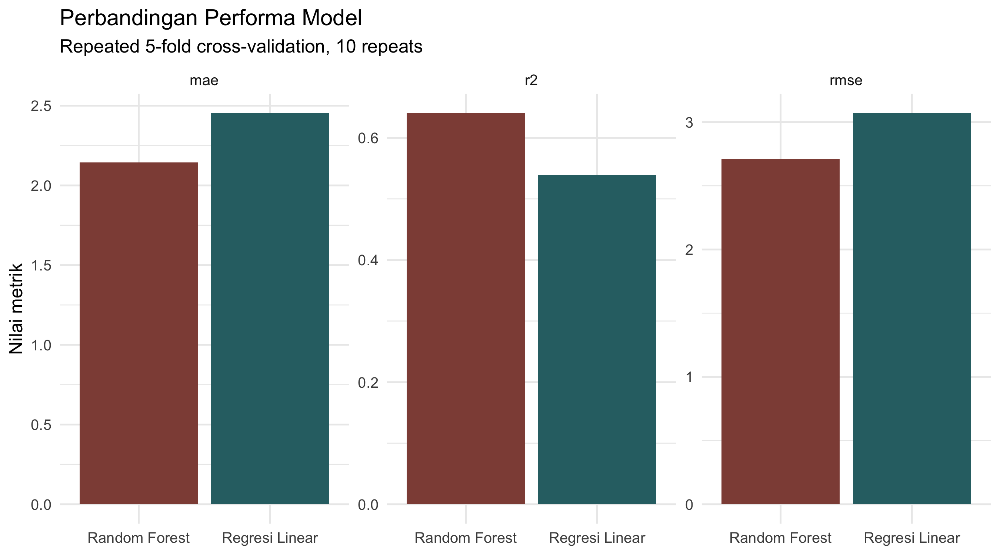
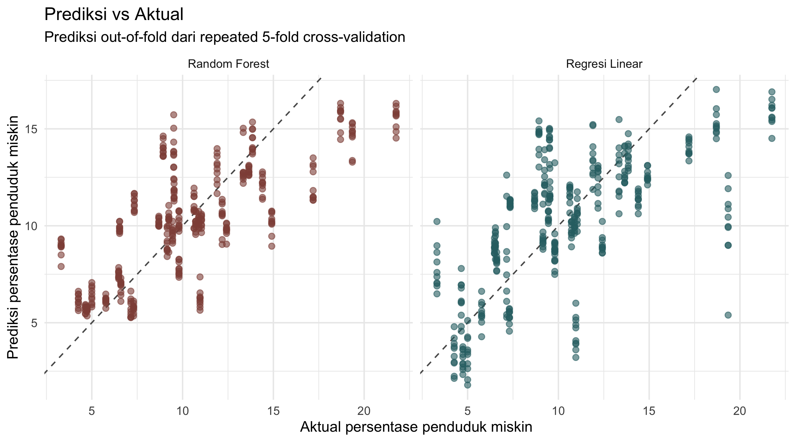
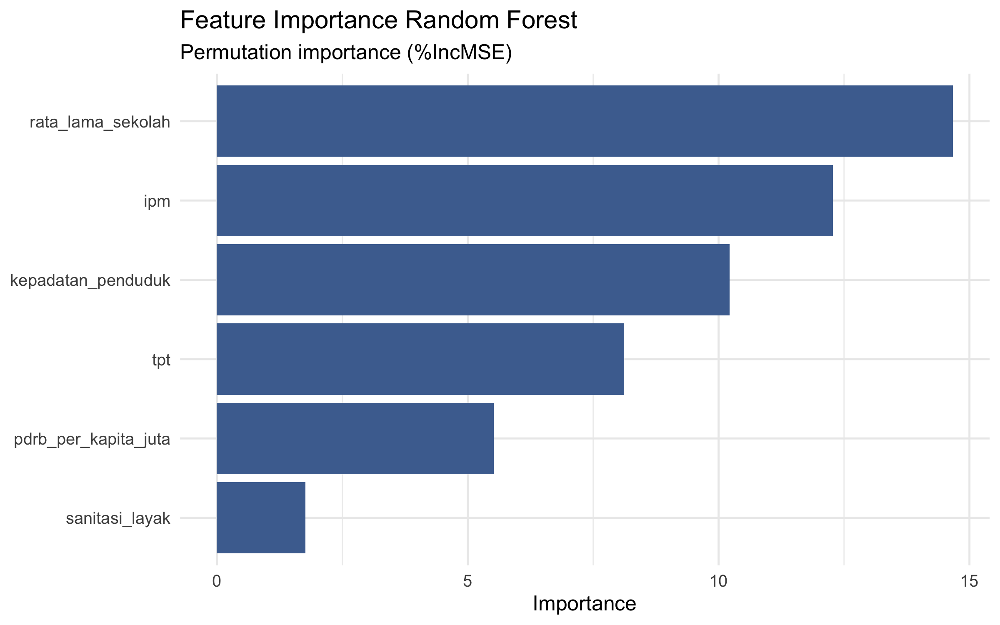

# Prediksi Persentase Penduduk Miskin di Jawa Timur (2023)

**Analisis data BPS untuk 38 kabupaten/kota · R · Regresi Linear · Random Forest**

Proyek ini membandingkan model untuk memperkirakan **persentase penduduk miskin** pada tingkat kabupaten/kota di Jawa Timur tahun 2023. Target tersebut adalah proporsi penduduk miskin (%), **bukan garis kemiskinan** (rupiah). Fokus proyek mencakup penggabungan tujuh tabel BPS, pemeriksaan data, analisis eksploratif, pemodelan, dan evaluasi prediksi. Data satu tahun ini tidak mendukung klaim sebab-akibat atau ramalan untuk tahun berikutnya.

## Data dan variabel

Satu baris mewakili satu kabupaten/kota; baris agregat Provinsi Jawa Timur dikeluarkan. CSV yang benar-benar dipakai pipeline tersimpan di [`data/raw/`](data/raw/), lalu digabung menjadi [`data/processed/model_dataset.csv`](data/processed/model_dataset.csv). Semua variabel merujuk pada 2023; target kemiskinan adalah pengukuran **Maret**, sedangkan TPT adalah **Agustus**. Tautan berikut mengarah ke tabel resmi BPS Provinsi Jawa Timur yang telah diperiksa; untuk tabel yang menampilkan beberapa tahun, pilih 2023. Karena tabel daring dapat direvisi, cocokkan ulang angka per wilayah dengan snapshot CSV jika memperbarui analisis.

| Peran       | Kolom model            | Ukuran dan asal data                                                                                                                                                                                                                                                                                                                                     |
| ----------- | ---------------------- | -------------------------------------------------------------------------------------------------------------------------------------------------------------------------------------------------------------------------------------------------------------------------------------------------------------------------------------------------------- |
| Target      | `persentase_miskin`    | Persentase penduduk miskin Maret (%); [BPS: kemiskinan kabupaten/kota 2023](https://jatim.bps.go.id/id/statistics-table/3/UkVkWGJVZFNWakl6VWxKVFQwWjVWeTlSZDNabVFUMDkjMw==/jumlah-dan-persentase-penduduk-miskin-menurut-kabupaten-kota-di-provinsi-jawa-timur--2023.html?year=2023)                                                                     |
| Prediktor 1 | `ipm`                  | Indeks Pembangunan Manusia; [BPS: IPM kabupaten/kota 2023](https://jatim.bps.go.id/id/statistics-table/3/V25GaFNHaExaMnhITm1sWmRrUlJZelJzYUc1SGR6MDkjMw==/indeks-pembangunan-manusia-menurut-kabupaten-kota-di-provinsi-jawa-timur--2023.html?year=2023)                                                                                                 |
| Prediktor 2 | `tpt`                  | Tingkat Pengangguran Terbuka Agustus (%); [BPS: TPT kabupaten/kota](https://jatim.bps.go.id/id/statistics-table/2/NTQjMg==/tingkat-pengangguran-terbuka--tpt--menurut-kabupaten-kota.html)                                                                                                                                                               |
| Prediktor 3 | `pdrb_per_kapita_juta` | PDRB per kapita ADHB (juta rupiah); nilai sumber dalam ribu rupiah dibagi 1.000; [BPS: PDRB per kapita kabupaten/kota](https://jatim.bps.go.id/id/statistics-table/2/MzI3IzI=/-seri-2010--pdrb-perkapita-atas-dasar-harga-berlaku-menurut-kabupaten-kota.html)                                                                                           |
| Prediktor 4 | `rata_lama_sekolah`    | Rata-rata lama sekolah penduduk 15 tahun ke atas (tahun); [BPS: RLS kabupaten/kota](https://jatim.bps.go.id/id/statistics-table/2/MzQ4IzI=/rata-rata-lama-sekolah-penduduk-15-tahun-keatas-.html)                                                                                                                                                        |
| Prediktor 5 | `sanitasi_layak`       | Rumah tangga dengan akses sanitasi layak (%); [BPS: sanitasi layak kabupaten/kota](https://jatim.bps.go.id/id/statistics-table/3/VGtGTU5qbDFlQzl1VWxCTVNWZElXbWRhWkUwMFVUMDkjMyMzNTAw/persentase-rumah-tangga-yang-memiliki-akses-terhadap-sanitasi-layak-menurut-kabupaten-kota-di-provinsi-jawa-timur.html)                                            |
| Prediktor 6 | `kepadatan_penduduk`   | Penduduk per km²; [BPS: kepadatan penduduk kabupaten/kota 2023](https://jatim.bps.go.id/id/statistics-table/3/V1ZSbFRUY3lTbFpEYTNsVWNGcDZjek53YkhsNFFUMDkjMw==/penduduk--laju-pertumbuhan-penduduk--distribusi-persentase-penduduk--kepadatan-penduduk--rasio-jenis-kelamin-penduduk-menurut-kabupaten-kota-di-provinsi-jawa-timur--2023.html?year=2023) |

## Metode dan hasil

Pipeline melakukan _inner join_ menurut nama wilayah, memilih enam prediktor di atas, dan memeriksa jumlah observasi, nilai hilang, duplikasi wilayah, serta rentang target. Regresi Linear menjadi pembanding yang mudah dibaca; Random Forest memakai **500 pohon** dan pencarian `mtry` **2–6**. Evaluasi disimpan dalam dua jalur:

1. **Repeated 5-fold cross-validation × 10** untuk analisis utama di [laporan R Markdown](report/laporan_kemiskinan_jatim.Rmd). Pada jalur ini, `mtry` Random Forest dipilih dan performanya dilaporkan dari resampling yang sama, sehingga angkanya dapat lebih optimistis.
2. **Nested cross-validation** sebagai pemeriksaan tambahan: 5 fold luar untuk pengujian, 3 fold dalam untuk memilih `mtry` Random Forest, serta baseline prediksi rerata target dari data latih tiap fold. Konfigurasi: seed 2026, 500 pohon, `mtry` 2–6. Ringkasannya berada di [`nested_cv_summary.csv`](output/tables/nested_cv_summary.csv), belum dibahas dalam laporan R Markdown yang tersedia.

| Evaluasi         | Model             |    RMSE ↓ |     MAE ↓ |      R² ↑ |
| ---------------- | ----------------- | --------: | --------: | --------: |
| Repeated CV × 10 | Regresi Linear    |     3,068 |     2,452 |     0,539 |
| Repeated CV × 10 | Random Forest     | **2,713** | **2,145** | **0,640** |
| Nested CV        | Rerata data latih |     4,286 |     3,326 |    −0,010 |
| Nested CV        | Regresi Linear    |     3,306 |     2,525 |     0,399 |
| Nested CV        | Random Forest     | **2,674** | **2,137** | **0,607** |

RMSE dan MAE dinyatakan dalam **poin persentase**. R² pada tabel repeated CV mengikuti ringkasan `caret` per resample di [`model_comparison.csv`](output/tables/model_comparison.csv); R² nested dihitung dari seluruh prediksi _out-of-fold_ di fold luar. Kedua R² memakai agregasi berbeda dan tidak perlu dibaca sebagai perbandingan satu banding satu. Random Forest memiliki error lebih rendah daripada Regresi Linear dan baseline pada evaluasi internal ini; 38 observasi membuat hasil sensitif terhadap pembagian fold.

### Visualisasi terpilih



_Perbandingan model dari repeated 5-fold CV × 10. Grafik ini menampilkan hasil jalur repeated CV, bukan nested CV._



_Prediksi vs aktual dari repeated CV; setiap wilayah muncul dalam beberapa pengulangan. Garis putus-putus menandai prediksi sama dengan nilai aktual._



_Permutation importance (`%IncMSE`) pada model Random Forest akhir. Rata-rata lama sekolah, IPM, dan kepadatan berada di urutan teratas; peringkat ini menjelaskan perilaku model, bukan pengaruh kausal._

## Peta repositori

| Lokasi                                                                                                  | Isi                                                                                                         |
| ------------------------------------------------------------------------------------------------------- | ----------------------------------------------------------------------------------------------------------- |
| [`data/raw/`](data/raw/)                                                                                | Tujuh CSV sumber BPS tahun 2023 yang dibaca pipeline.                                                       |
| [`data/processed/`](data/processed/)                                                                    | Dataset hasil gabung dan dataset delapan kolom untuk pemodelan.                                             |
| [`scripts/run_all.R`](scripts/run_all.R)                                                                | Menjalankan impor, EDA, preprocessing, pemodelan, repeated CV, dan nested CV secara berurutan.              |
| [`scripts/validation.R`](scripts/validation.R) dan [`tests/test_validation.R`](tests/test_validation.R) | Pemeriksaan input dan evaluasi nested; pengujian fungsi validasi.                                           |
| [`output/tables/`](output/tables/)                                                                      | Statistik, diagnostik, prediksi _out-of-fold_, dan metrik evaluasi.                                         |
| [`output/figures/`](output/figures/) dan [`output/models/`](output/models/)                             | Grafik dan model R tersimpan.                                                                               |
| [`report/laporan_kemiskinan_jatim.Rmd`](report/laporan_kemiskinan_jatim.Rmd)                            | Sumber laporan yang menjalankan ulang pipeline; [lihat laporan HTML](report/laporan_kemiskinan_jatim.html). |
| [`renv.lock`](renv.lock)                                                                                | Versi R dan paket untuk pemulihan lingkungan.                                                               |

## Reproduksi

Gunakan **R 4.1 atau lebih baru** (`|>` dipakai di skrip); `renv.lock` mencatat R 4.6.0. Dari direktori utama repositori, dengan berkas `data/raw/` tetap pada tempatnya:

```sh
Rscript -e 'install.packages("renv")'  # bila belum terpasang
Rscript -e 'renv::restore(prompt = FALSE)'
Rscript tests/test_validation.R
Rscript scripts/run_all.R
Rscript -e 'rmarkdown::render("report/laporan_kemiskinan_jatim.Rmd", output_format = "html_document")'
```

Render R Markdown menjalankan ulang pipeline. Angka dan gambar dapat berubah jika data sumber atau versi paket berubah.

## Batasan

- **Sampel kecil dan satu tahun.** Pembagian fold dapat memengaruhi estimasi; hasil ini belum diuji pada tahun atau provinsi lain.
- **Data potong lintang.** Korelasi, koefisien, dan _feature importance_ tidak membuktikan bahwa suatu indikator menyebabkan kemiskinan.
- **Prediktor saling berkaitan.** IPM dan rata-rata lama sekolah, misalnya, dapat membawa informasi yang tumpang tindih; interpretasi koefisien memerlukan kehati-hatian.
- **Provenance snapshot.** Sebelum memakai angka untuk keputusan, periksa kembali kesesuaian CSV 2023 dengan tabel BPS terkini, khususnya seri yang belum memiliki tautan terverifikasi.

Langkah berikutnya yang paling bernilai adalah validasi pada data tahun lain dan audit sumber data per wilayah.
